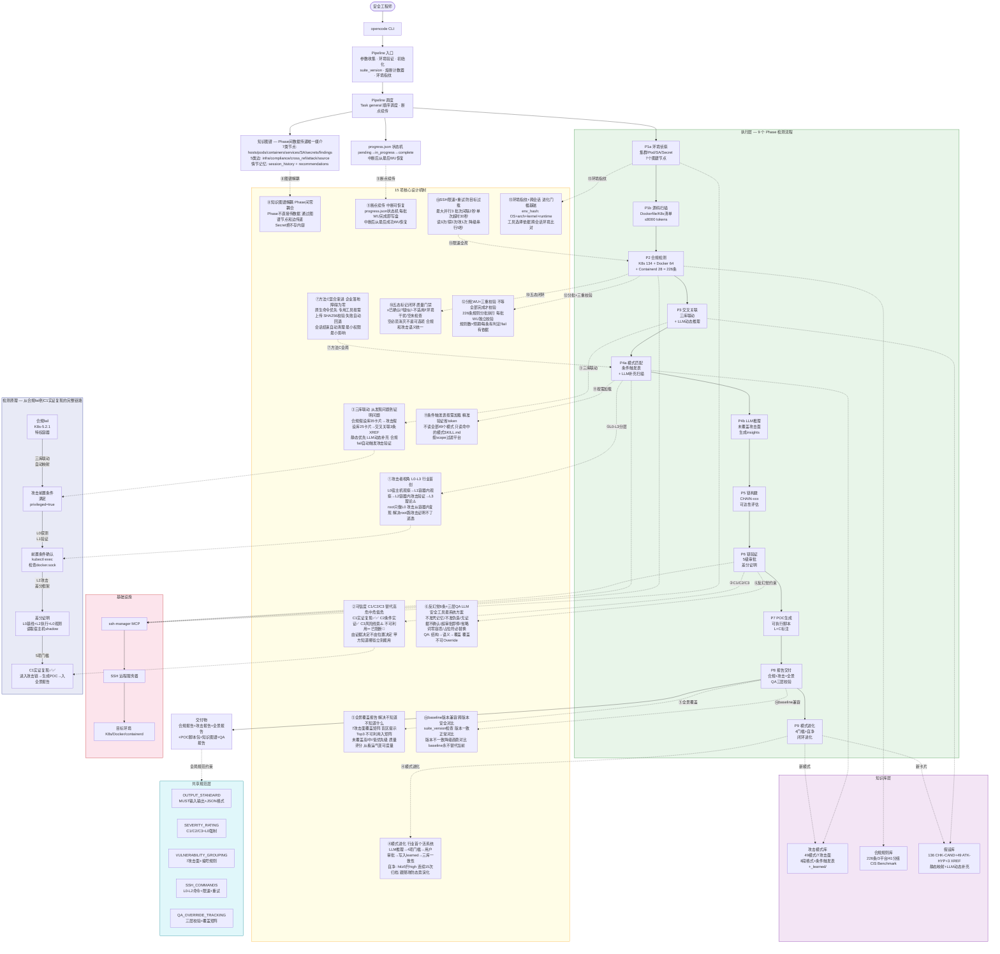
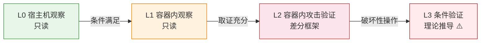
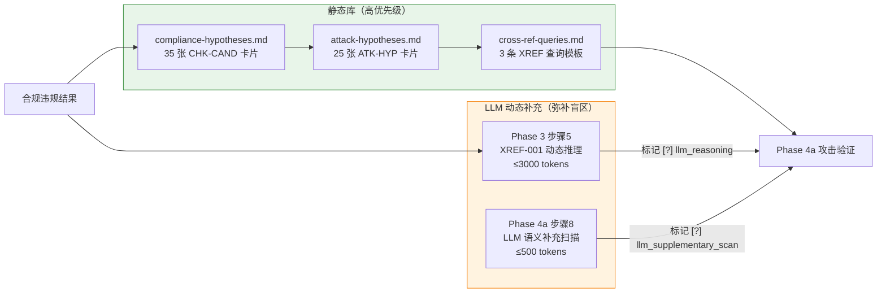
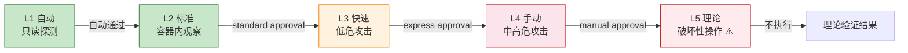
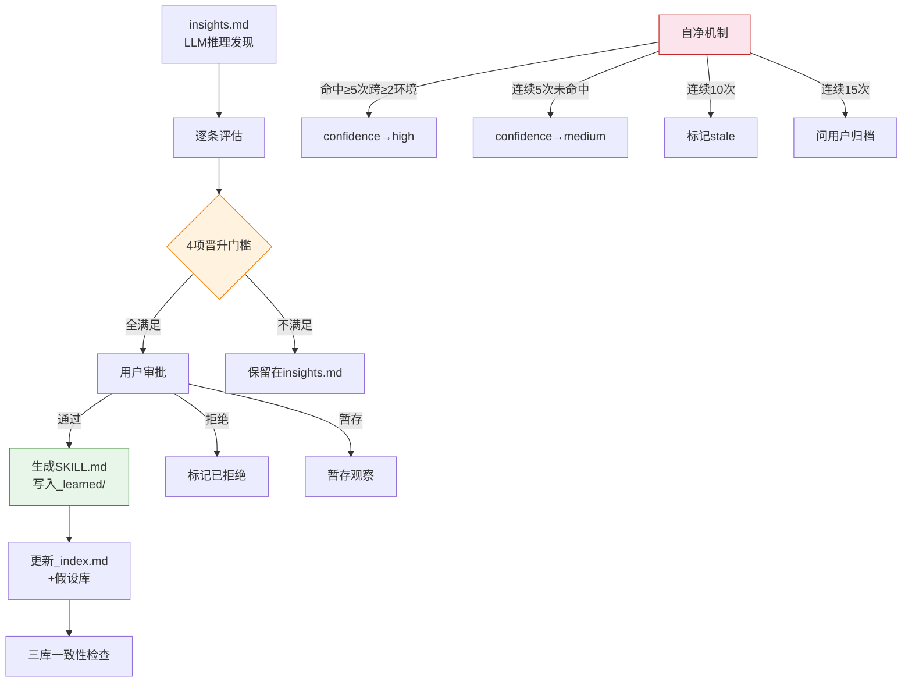
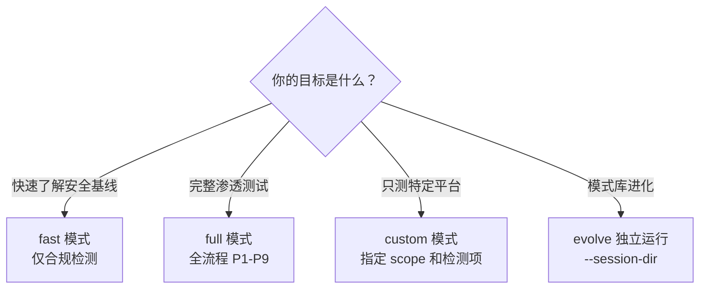

# GenCPT

> 容器与 Kubernetes 渗透测试技能套件 — 基于 LLM 语义驱动的全流程安全评估框架

通过 SSH 远程对 K8s / Docker / containerd 环境执行 **合规检测 → 攻击验证 → 链式攻击 → POC 生成 → 报告交付** 全流程渗透测试。所有逻辑由 LLM 语义驱动，产出物为 Markdown 报告和 JSON 知识图谱。支持攻击模式库自我进化。

---


## 系统全景图

> 一张图理解整个系统：五层架构 × 9 个 Phase 流程 × 15 项设计机制 × 知识图谱流转 × 检测原理



**阅读指南**：

| 区域 | 颜色 | 内容 |
|------|------|------|
| **执行流程** | 绿色 | 9个Phase从左到右：侦察→合规→关联→攻击→链→验证→POC→报告→进化 |
| **设计机制** | 黄色 | 15项核心设计机制，每项含内部机制+业务价值，虚线关联到对应Phase |
| **知识库** | 紫色 | 29攻击模式+226合规规则+60假设卡片，三库咬合联动 |
| **规范层** | 青色 | 5个共享规范，定义全局标准 |
| **基础设施** | 红色 | ssh-manager MCP → SSH → 目标环境 |
| **检测原理** | 蓝色 | 从合规fail到C1实证的完整数据流链路 |

**15项设计机制速查**：

| # | 机制 | 行业定位 | 关联Phase |
|---|------|---------|----------|
| ① | 攻击者视角L0-L3 | 行业首创 | 4a/6 |
| ② | 可信度C1/C2/C3 | 替代高/中/低危 | 6 |
| ③ | 三库联动 | 从发现问题到证明问题 | 3 |
| ④ | 模式进化 | 行业首个活系统 | 9 |
| ⑤ | 全景覆盖报告 | 解决不知道不知道什么 | 8 |
| ⑥ | 反幻觉+QA | LLM安全工具最系统方案 | 全局 |
| ⑦ | 方法C混合渐进 | 企业落地障碍为零 | 全局 |
| ⑧ | 知识图谱解耦 | Phase间零耦合 | 全局 |
| ⑨ | 断点续传 | 中断可恢复 | 编排层 |
| ⑩ | 五态标记闭环 | 质量门禁 | 全局 |
| ⑪ | 条件触发表按需加载 | 精准验证省token | 4a |
| ⑫ | 分批WU+三重校验 | 不等全部完成才校验 | 2 |
| ⑬ | SSH限速+重试 | 防目标过载 | 全局 |
| ⑭ | baseline版本兼容 | 跨版本安全对比 | 8c |
| ⑮ | 环境指纹+跨会话 | 进化门槛基础 | 1a |

---
## 核心流程

```mermaid
flowchart TB
    START([用户输入参数<br/>server / mode / scope / approval]) --> ENV[环境验证<br/>SSH连通性 / OS / 运行时版本]
    ENV --> INIT[初始化工作目录<br/>session_config / progress / evidence]
    INIT --> AGENT[启动 Task general 顺序调度]

    AGENT --> P1

    subgraph P1[Phase 1 — 侦察]
        direction TB
        P1A[P1a 环境侦察<br/>集群结构 / Pod / SA / Secret] --> P1B[P1b 源码扫描<br/>Dockerfile / K8s清单 / CI/CD]
    end

    P1 --> P2

    subgraph P2[Phase 2 — 合规检测]
        direction TB
        P2A[K8s 134条<br/>29个分组] --> P2B[Docker 64条<br/>7个分组] --> P2C[Containerd 28条<br/>5个分组]
    end

    P2 --> P3

    subgraph P3[Phase 3 — 交叉关联]
        direction TB
        P3A[静态映射<br/>三库联动] --> P3B[LLM动态推理<br/>补充盲区]
        P3B --> P3C[风险叠加分析<br/>≥3种违规放大]
    end

    P3 --> P4

    subgraph P4[Phase 4 — 攻击验证]
        direction TB
        P4A[P4a 模式匹配<br/>条件触发表 + LLM补充扫描] --> P4B{匹配?}
        P4B -->|已知模式| P4V[执行验证 L0/L1/L2]
        P4B -->|未匹配| P4C[P4b LLM推理]
        P4C --> P4V
    end

    P4 --> P5

    subgraph P5[Phase 5 — 攻击链构建]
        direction TB
        P5A[提取 confirmed 项] --> P5B[图谱查找可达路径]
        P5B --> P5C[评估链式影响] --> P5D[分配 CHAIN 编号]
    end

    P5 --> P6

    subgraph P6[Phase 6 — 攻击链验证]
        direction TB
        P6A[逐链验证] --> P6B[5级审批门控]
        P6B --> P6C[差分证明<br/>L0基线+L2执行+L0观测]
        P6C --> P6D[可信度判定<br/>C1/C2/C3]
    end

    P6 --> P7

    subgraph P7[Phase 7 — POC 生成]
        P7A[筛选 confirmed / condition_met] --> P7B[生成可执行脚本<br/>标注 L0/L1/L2 + C1/C2/C3]
    end

    P7 --> P8

    subgraph P8[Phase 8 — 报告交付]
        direction TB
        P8A[合规报告] --> P8B[攻击报告] --> P8C[全景报告<br/>10章 + 覆盖矩阵 + 盲区提示]
        P8C --> P8D[QA三层校验<br/>结构 / 语义 / 覆盖]
    end

    P8 --> P9[Phase 9 — 模式进化<br/>LLM推理发现晋升]
    P9 --> END([交付报告 + POC 包])

    style START fill:#c8e6c9,stroke:#2e7d32
    style END fill:#c8e6c9,stroke:#2e7d32
    style AGENT fill:#fff3e0,stroke:#f57c00
```



---

## 亮点设计

### 1. 反幻觉六条硬约束

每个执行 Phase 的 SKILL.md 中都强制写入 6 条反幻觉规则，防止 LLM 编造结果：

| 约束 | 说明 |
|------|------|
| **不准凭记忆出攻击命令** | 必须读取攻击模式 SKILL.md 后才执行探测，禁止从上下文记忆中提取命令 |
| **不准伪造 SSH 输出** | 每条判定必须附原始命令输出，省略词零容忍（禁用"等/.../+N/大致/约"） |
| **无证据不写确认态** | `[x]` 确认必须有差分证明，`[?]` 疑似需标注待验证原因 |
| **占位符必须替换** | 报告模板中的 `{{}}` 占位符必须全部替换为实际数据 |
| **超出审批立即停** | L5 操作不生成执行命令，超时降级为理论验证 |
| **baseline 永不替代当前测试** | baseline 报告仅用于 diff 对比，当前测试结果始终是权威结果 |

### 2. 攻击者视角分层（L0-L3）

SSH root 权限仅用于 L0 侦察，不替代 L1/L2 攻击者视角。防止"用宿主机权限伪造容器内攻击成功"的常见误判。

| 层级 | 名称 | 执行方式 | 用途 |
|------|------|---------|------|
| **L0** | 宿主机观察 | `ssh_execute` 直接执行 | 发现前置条件、收集配置、差分对比 |
| **L1** | 容器内观察 | `kubectl exec` / `docker exec` | 验证容器内实际生效的安全配置 |
| **L2** | 容器内攻击验证 | `kubectl exec` + 差分框架 | 执行攻击命令，前后对比证明 |
| **L3** | 条件验证 | 理论推导（不执行） | 破坏性操作标 ⚠️，做理论验证 |



### 3. 可信度分级（C1/C2/C3）

验证结果按证据充分度分为三级，由证据决定而非执行位置决定：

| 等级 | 名称 | 条件 | 报告标注 |
|------|------|------|---------|
| **C1** | 实证复现 | 5 项门槛全满足 + L2 差分证明 | ✅✅ confirmed |
| **C2** | 条件实证 | 前置条件满足 + 理论链路完整（被阻断或不可安全复现） | ✅ condition_met |
| **C3** | 风险线索 | 配置隐患 + 前置条件不完全满足 | ⚠️ high_risk_clue |

**5 项确认门槛**：①前置条件可复现 ②可执行 ③可区分 ④影响可观测 ⑤可恢复

**差分证明 L0 观测强制要求**（按攻击类型分级）：

| 攻击类型 | 差分证明要求 | 不满足时 |
|---------|------------|---------|
| AS-1 逃逸 | 必须 `[L0]基线 + [L2]执行 + [L0]观测` 三段式 | C1 降级 C2 |
| AS-5 DoS | 必须 `[L0]资源监控基线 + [L2]执行 + [L0]对比` | C1 降级 C2 |
| AS-7 持久化 | 必须 `[L0]宿主机文件检查` | C1 降级 C2 |
| AS-3 网络 / AS-4 数据 | `[L1]基线 + [L2]执行 + [L1]观测` | 不强制 L0 |

### 4. 五态标记闭环

所有发现项使用五态标记，`[ ]` 未检查最终必须消灭：

| 标记 | 含义 | 合规语义 | 攻击语义 |
|------|------|---------|---------|
| `[x]` | 已确认 | fail（违规确认） | confirmed（攻击成功） |
| `[?]` | 疑似 | 存在可疑发现，需深审 | 存在可疑面，需 Phase 4b 深审 |
| `[-]` | 不适用 | na / pass（通过） | disproved（已证伪） |
| `[!]` | 环境干扰 | 命令执行失败 | 被安全机制阻断 |
| `[ ]` | 未检查 | 过程态，必须消灭 | 过程态，必须消灭 |

### 5. 三库联动 + LLM 动态补充



- **静态库**：提供高置信度、经过验证的已知映射，优先级更高
- **LLM 动态推理**：弥补静态库覆盖盲区，特别关注 `_learned/` 新模式和罕见违规组合
- **动态推理结果**标记 `[?]`，需 Phase 4a 额外验证后方可升级为 `[x]`

### 6. 5 级审批门控 + 安全熔断



**安全熔断机制**：auto 模式下 10 分钟内 ≥5 次 L3/L4 自动通过 → 触发熔断 → 强制下一个 L4 需 manual approval。防止 LLM 幻觉导致连续自动审批高破坏性命令。

### 7. 攻击模式库 — 8 段格式 + 条件触发表

49 个攻击模式覆盖 7 大攻击面，每个模式包含 8 段结构化描述：

| 攻击面 | 模式数 | 代表模式 |
|--------|--------|---------|
| AS-1 逃逸 | 7 | socket-escape、cgroup-escape、procfs-escape、runc-escape、hostpath-mount、capability-privesc、containerd-shim-escape |
| AS-2 认证授权 | 4 | k8s-sa-exploit、k8s-rbac-abuse、k8s-anonymous-access、docker-api-auth |
| AS-3 网络 | 4 | lateral-move、cloud-metadata、dns-exfil、ntfs-alpn |
| AS-4 数据泄露 | 3 | secret-exfil、env-credential-leak、image-layer-secret |
| AS-5 拒绝服务 | 2 | resource-abuse、fork-bomb |
| AS-6 供应链 | 2 | image-tag-mutation、registry-poison |
| AS-7 持久化 | 3 | webhook-backdoor、cronjob-persist、docker-volume-persist |

**8 段格式**：①前置条件 ②探测命令 ③攻击验证 ④差分证明 ⑤绕过策略 ⑥证伪条件 ⑦审批级别 ⑧MITRE ATT&CK 映射

**条件触发表**：`_index.md` 中 25+ 条触发信号→模式映射，Phase 4a 按需加载（不读全部模式），按 scope 过滤平台。

### 8. 攻击模式自我进化（Phase 9）



**4 项晋升门槛**：①差分证明充分 ②探测可复现（≥2 环境）③无法匹配现有模式 ④跨会话命中 ≥2 次

### 9. QA 三层校验 + 覆盖矩阵

| 层级 | 校验内容 | 可否 Override |
|------|---------|--------------|
| **第一层** 结构校验 | MUST 输出文件存在、知识图谱边节点对应、ATK-CAND 编号连续、五态无 `[ ]` 残留 | 否 |
| **第二层** 语义校验 | 5 条合规 + 3 条 ATK-CAND + 2 条 `[-]` 抽检，ssh_execute 重新验证 | 是（记录原因） |
| **第三层** 覆盖校验 | 7 攻击面 × 模式覆盖矩阵无空白，226 条合规规则覆盖矩阵无空白 | 否 |

**覆盖矩阵**：行=7 攻击面，列=模式库覆盖/LLM 推理覆盖/总覆盖。**不可利用（已证伪）项必须出现在覆盖矩阵中**，标注"已检查不可利用 + 证伪依据"。

### 10. 全景报告 — 10 章 + 最大盲区提示

| 章 | 内容 |
|----|------|
| 1 | 执行详情（时间/模式/环境/Phase 统计） |
| 2 | 环境覆盖全景（侦察/源码/合规覆盖率） |
| **2.5** | **⚠️ 最大检测盲区提示**（Top 3 高优先级盲区） |
| 3 | 合规分组热力图 |
| 4 | 攻击面覆盖矩阵（7 攻击面 × 模式/LLM/总覆盖） |
| 5 | 已知模式库覆盖全景 |
| 6 | LLM 推理覆盖全景 |
| 7 | 攻击验证结果分布（C1/C2/C3/不可利用/已阻断） |
| 8 | 漏洞来源标识（📚 已知模式库 / 🧠 LLM 推理 / 🔄 学习模式） |
| 9 | 未覆盖事项及原因（高/中/低优先级 + 盲区提示） |
| 10 | 产品安全质量评估（综合评分 + Top 5 风险） |

---

## 合规规则库

基于 CIS Benchmark 标准，覆盖三大容器平台：

| 平台 | 规则数 | 分组数 | Benchmark 版本 |
|------|--------|--------|---------------|
| Kubernetes | 134 | 29 | CIS Kubernetes Benchmark v1.8.0 |
| Docker | 64 | 7 | CIS Docker Benchmark v1.6.0 |
| Containerd | 28 | 5 | CIS Containerd Benchmark |
| **合计** | **226** | **41** | |

每条规则包含：编号、描述、检查命令（标注 L0/L1）、期望值、判定标准（pass/fail/warn/na）、修复建议、CIS 映射、攻击面关联。

---

## 使用场景



| 场景 | 推荐模式 | scope | approval | 预期产出 |
|------|---------|-------|---------|---------|
| 新环境接入，快速摸底 | `fast` | `all` | `standard` | 合规基线报告 |
| 定期安全合规巡检 | `fast` | `all` | `standard` | 合规基线 + baseline diff |
| 完整渗透测试（授权） | `full` | `all` | `standard` | 合规报告 + 攻击报告 + POC + 全景报告 |
| 只关注容器逃逸风险 | `full` | `k8s` | `standard` | 逃逸路径验证 + POC |
| 红蓝对抗演练 | `full` | `all` | `express` | 攻击链 + 差分证明 |
| 合规整改后复核 | `fast` | `docker`+`containerd` | `standard` | 合规 diff 报告 |
| 攻击模式库进化 | — | — | — | evolve_report.md |

---

## 使用方法

### 前提条件

- opencode（或兼容的 AI coding agent）
- SSH 远程访问目标服务器（需配置 ssh-manager MCP）
- 目标环境：K8s / Docker / containerd 之一或全部

### 配置 MCP

```json
{
  "mcp": {
    "ssh-manager": {
      "type": "local",
      "enabled": true,
      "command": ["npx", "-y", "mcp-ssh-manager"]
    }
  }
}
```

### 触发方式

在 opencode 对话中使用以下关键词触发：

```
用 GenCPT 对服务器 prod-k8s-01 做完整渗透测试
对服务器 docker-host 做 fast 模式检查，scope=docker
渗透测试 服务器 k8s-cluster，scope=k8s，approval=express
```

### 参数说明

| 参数 | 类型 | 必填 | 默认值 | 说明 |
|------|------|------|--------|------|
| `server` | string | 是 | — | 目标服务器名称（来自 ssh-manager 配置） |
| `mode` | enum | 否 | `full` | `fast`（仅合规）/ `full`（全流程）/ `custom`（自定义项） |
| `scope` | enum | 否 | `all` | `k8s` / `docker` / `containerd` / `all` |
| `approval` | enum | 否 | `standard` | `standard` / `express` / `manual` |
| `source-path` | string | 否 | — | 自定义攻击模式路径 |
| `baseline` | string | 否 | — | baseline 报告路径，用于 diff 对比 |

### 独立运行某个 Phase

部分子技能支持独立运行（不依赖 Pipeline）：

| 子技能 | 独立运行参数 | 依赖前提 |
|--------|------------|---------|
| recon | `--server <名称> --scope k8s,docker` | SSH 连通 |
| recon-source | `--source-path <路径>` | 无 |
| k8s-compliance | `--server <名称> --scope k8s` | Phase 1a 输出 |
| docker-compliance | `--server <名称> --scope docker` | Phase 1a 输出 |
| containerd-compliance | `--server <名称> --scope containerd` | Phase 1a 输出 |
| chain-builder | `--session-dir <路径>` | Phase 4 + Phase 3 输出 |
| chain-verify | `--session-dir <路径>` | Phase 5 输出 |
| poc-generator | `--session-dir <路径>` | Phase 6 输出 |
| report-compliance | `--session-dir <路径>` | Phase 2 输出 |
| report-attack | `--session-dir <路径>` | Phase 4-7 输出 |
| report-summary | `--session-dir <路径>` | Phase 8a + 8b 输出 |
| evolve | `--session-dir <路径>` | insights.md + session_history |

---

## 产出物

```
/tmp/gencpt-<session_id>/
├── session_config.json          # 环境指纹 + 会话参数 + suite_version
├── progress.json                # Phase 进度（断点续传）
├── evidence/
│   ├── recon/                   # 侦察原始数据
│   ├── compliance/              # 合规检测结果
│   ├── cross-ref/               # 交叉关联分析
│   ├── attack/                  # 攻击验证证据
│   ├── chains/                  # 攻击链验证记录
│   ├── poc/                     # POC 脚本包
│   ├── evolve/                  # 进化报告
│   └── qa/                      # QA 校验记录
├── reports/
│   ├── compliance_report.md     # 合规检测报告
│   ├── attack_report.md         # 攻击验证报告
│   ├── pentest_report.md        # 全景综合报告（10 章）
│   └── coverage_report.md       # 覆盖矩阵报告
└── knowledge_graph/
    ├── nodes/                   # 知识图谱节点（7 类 JSON）
    └── edges/                   # 知识图谱边（5 类 JSON）
```

---

## 目录结构

```
GenCPT/
├── SKILL.md                        # Pipeline 入口
├── README.md                       # 本文件
├── skills/                         # 15 个 Phase 子技能
│   ├── shared/                     # 5 个共享规范
│   │   ├── OUTPUT_STANDARD.md      # 输出格式标准
│   │   ├── SEVERITY_RATING.md      # 严重度评级 C1/C2/C3
│   │   ├── VULNERABILITY_GROUPING.md  # 7 大攻击面定义
│   │   ├── SSH_COMMANDS.md         # SSH 命令模板 + 限速 + 重试
│   │   └── QA_OVERRIDE_TRACKING.md # QA 三层校验规则
│   ├── recon/SKILL.md              # Phase 1a 环境侦察
│   ├── recon-source/SKILL.md       # Phase 1b 源码扫描
│   ├── k8s-compliance/SKILL.md     # Phase 2a K8s 合规
│   ├── docker-compliance/SKILL.md  # Phase 2b Docker 合规
│   ├── containerd-compliance/SKILL.md  # Phase 2c Containerd 合规
│   ├── cross-ref/SKILL.md          # Phase 3 交叉关联
│   ├── attack-pattern/SKILL.md     # Phase 4a 模式匹配攻击
│   ├── attack-reasoning/SKILL.md   # Phase 4b LLM 推理攻击
│   ├── chain-builder/SKILL.md      # Phase 5 攻击链构建
│   ├── chain-verify/SKILL.md       # Phase 6 攻击链验证
│   ├── poc-generator/SKILL.md      # Phase 7 POC 生成
│   ├── report-compliance/SKILL.md  # Phase 8a 合规报告
│   ├── report-attack/SKILL.md      # Phase 8b 攻击报告
│   ├── report-summary/SKILL.md     # Phase 8c 全景报告
│   └── evolve/SKILL.md             # Phase 9 模式进化
├── attack-patterns/                # 攻击模式库（29 模式 / 7 攻击面）
│   ├── _index.md                   # 索引 + 条件触发读取表
│   ├── escape/  auth/  network/  data/  dos/  supply/  persist/
│   └── */_learned/                 # 学习模式目录
├── compliance-rules/               # CIS 合规规则库（226 条 / 3 平台）
│   ├── kubernetes/  docker/  containerd/
│   └── */_index.md
├── hypothesis-libraries/           # 假设库（3 库联动）
│   ├── compliance-hypotheses.md    # 35 张 CHK-CAND 卡片
│   ├── attack-hypotheses.md        # 25 张 ATK-HYP 卡片
│   └── cross-ref-queries.md        # 3 条 XREF 查询模板
├── references/                     # 参考文件
│   ├── compliance.md               # 安全红线 + 规则编写规范
│   ├── workspace-contract.md       # 工作目录规范
│   ├── quality_check_templates.md  # 质检校验清单
│   ├── attack-surface-model.md     # 7 大攻击面框架
│   ├── promotion-criteria.md       # 晋升判定规则
│   ├── promotion-template.md       # 晋升模板
│   └── report-templates/           # 3 个报告模板
└── tools/                          # 辅助工具索引
    └── _index.md
```

---

## 安全保障

### 安全红线

| 红线 | 说明 |
|------|------|
| 禁止实际损害 | 不利用漏洞造成实际损害 |
| 禁止持久化后门 | 不植入持久化机制 |
| 禁止数据外泄 | 不向外泄露任何数据 |
| 禁止影响可用性 | 不影响生产环境可用性 |

### 破坏性操作防护

- 破坏性命令标注 `destructive: true`，需 manual approval
- L3 条件验证：破坏性操作做理论验证（不执行），标 ⚠️
- 安全熔断：10 分钟内 ≥5 次 L3/L4 自动通过 → 强制 manual
- L2 攻击验证必须包含回滚/清理步骤
- Secret 节点**绝不存储内容**（仅名称 + 类型）

### SSH 命令安全

- L0/L1 命令只读，不修改系统状态
- L2 命令需差分框架和回滚计划
- 禁止命令黑名单：`rm -rf /`、`dd`、fork bomb、`mkfs`、`shutdown`
- SSH 限速：最大并行 3、批次间隔 2 秒、单次超时 30 秒

---

## 技术规格

| 维度 | 数值 |
|------|------|
| Phase 子技能 | 15 个 + 1 个 Pipeline 入口 |
| 攻击模式 | 49 个（7 攻击面） |
| 合规规则 | 226 条（K8s 134 + Docker 64 + Containerd 28） |
| 假设库卡片 | 185 张（136 CHK-CAND + 49 ATK-HYP） |
| 共享规范 | 5 个文件 |
| 参考文件 | 6 个 + 3 个报告模板 |
| 8 段格式攻击模式 | 49/49 完整 |
| frontmatter 字段 | 9 个（7 必填 + 2 learned 特有） |
| 执行上下文层级 | L0/L1/L2/L3 |
| 可信度等级 | C1/C2/C3 |
| 审批门控 | 5 级 + 安全熔断 |
| QA 校验 | 3 层（结构/语义/覆盖） |
| 五态标记 | `[x]` `[?]` `[-]` `[!]` `[ ]` |
| 总文件数 | 106 |

---

## 扩展

### 添加新攻击模式

1. 在 `attack-patterns/{攻击面}/` 下创建子目录及 `SKILL.md`
2. 按 8 段格式编写，frontmatter 含 7 个必填字段
3. 更新 `attack-patterns/_index.md` 条件触发读取表
4. 更新 `hypothesis-libraries/attack-hypotheses.md` 增加假设卡片

### 合规规则扩展

在 `compliance-rules/{平台}/` 下添加分组文件，更新 `_index.md`。

### 攻击模式进化

运行 `evolve` 子技能，LLM 推理发现经 4 项门槛检查 + 用户审批后晋升为新模式，写入 `_learned/` 目录。

---

## 许可证

Private — 内部使用，未经授权禁止分发。

---

## 相关链接

- [CIS Kubernetes Benchmark](https://www.cisecurity.org/benchmark/kubernetes)
- [CIS Docker Benchmark](https://www.cisecurity.org/benchmark/docker)
- [CIS Containerd Benchmark](https://www.cisecurity.org/benchmark/containerd)
- [MITRE ATT&CK](https://attack.mitre.org/)
- [mcp-ssh-manager](https://github.com/bvisible/mcp-ssh-manager)
